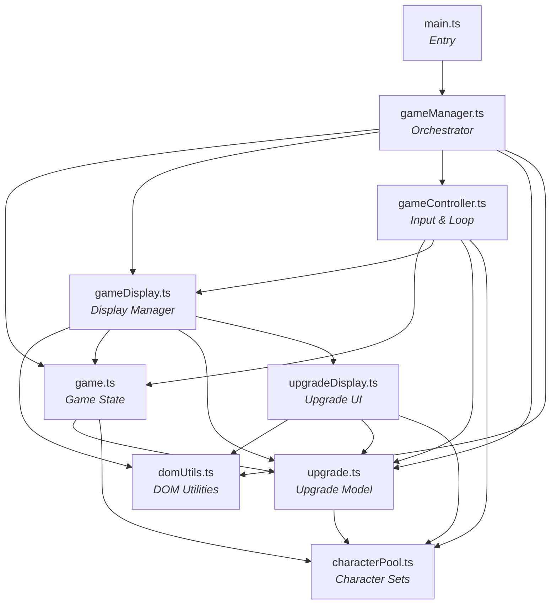
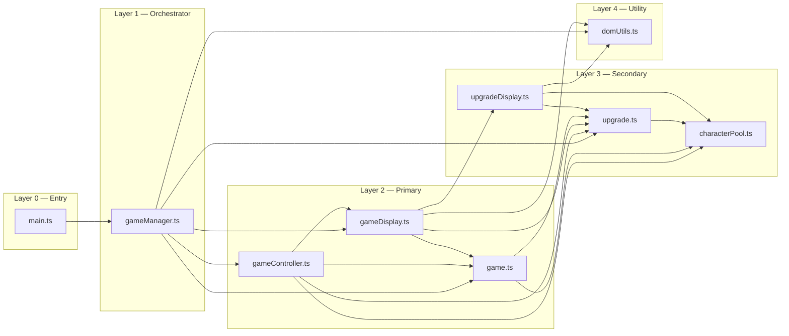
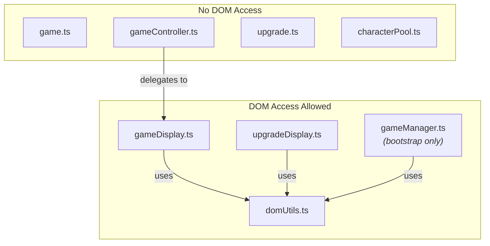
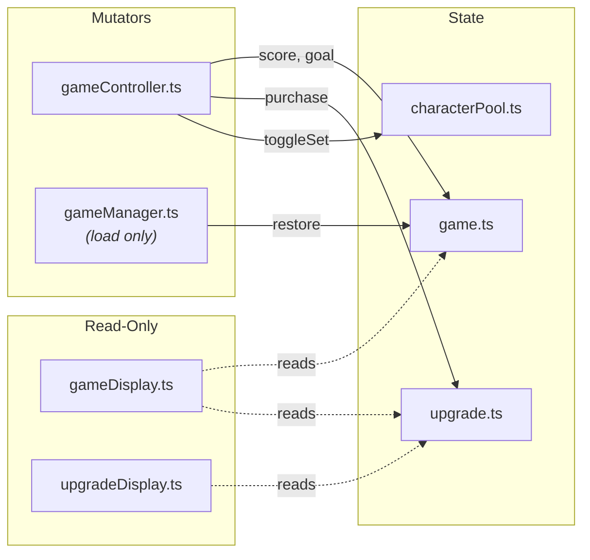

# Architecture Baseline — Javelin Idle

Generated: 2026-03-26

## Module Dependency Graph

## Layered Architecture

## DOM Access Boundary

## State Mutation Flow

## Module Summary

| Module | Layer | Lines | DOM | Mutates State | Imports From |
|--------|-------|-------|-----|---------------|--------------|
| main.ts | 0 | 6 | No | No | gameManager |
| gameManager.ts | 1 | 86 | Bootstrap | Indirect (load) | game, gameDisplay, gameController, upgrade, domUtils |
| game.ts | 2 | 205 | No | Yes (own state) | upgrade, characterPool |
| gameController.ts | 2 | 187 | No (via display) | Yes (score, goal, purchases) | game, gameDisplay, upgrade, characterPool |
| gameDisplay.ts | 2 | 241 | Yes | No | domUtils, game, upgrade, upgradeDisplay |
| upgrade.ts | 3 | 56 | No | Yes (owned, cost) | characterPool |
| upgradeDisplay.ts | 3 | 77 | Yes | No | domUtils, upgrade, characterPool |
| characterPool.ts | 3 | 157 | No | Yes (set toggles) | none |
| domUtils.ts | 4 | 36 | Yes (utilities) | No | none |
